# Lucky Boy 🍀

A feature-rich, cross-platform Game Boy emulator written in Go, with a modern graphical interface and an integrated graphical debugger.

It currently supports the original DMG Game Boy and the Game Boy Color.

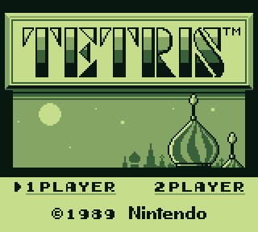
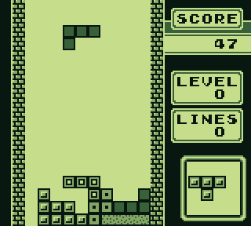

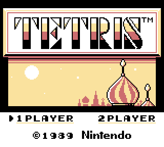
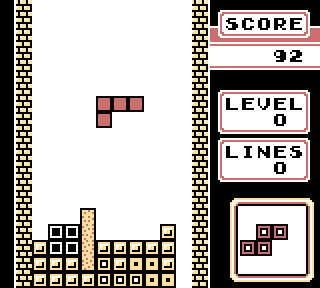

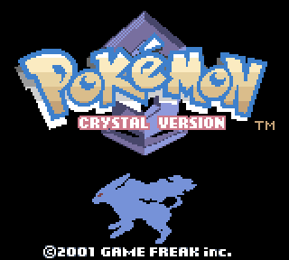
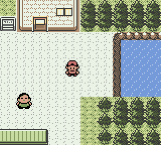

## Features

- **Accurate Emulation**: Implements the full Game Boy Z80-like CPU, with cycle accurate timing.
  It passes Both [Blargg's](https://github.com/retrio/gb-test-roms) and [Gekkio's](https://github.com/Gekkio/mooneye-test-suite) test suites (some tests require the original boot rom).
- **PPU (Graphics) Emulation**: Renders original Game Boy graphics with accurate timing and palette.
- **Serial data transfer**: Emulates with high accuracy Game Link Cable (must start one instance with `-serial master` flag and the other with `-serial slave`).
- **Debugger**: Integrated graphical debugger with disassembly, memory viewer, register viewer, breakpoints, and step/continue/reset controls.
- **Boot ROM**: Possibility to specify a boot rom with the `-boot-rom` flag, `None` skips it and sets the state of the emulator like after executing the original ROM.
- **Cross-platform GUI**: Built with [Ebiten](https://ebiten.org/)  and [EbitenUI](https://ebitenui.github.io/)
- **Color Correction**: Applies accurate color correction for Game Boy Color games, replicating the look of the original LCD screen.

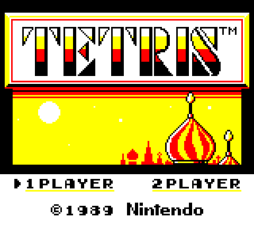


### Debugger

The integrated debugger provides a comprehensive set of tools for analyzing and debugging Game Boy games:

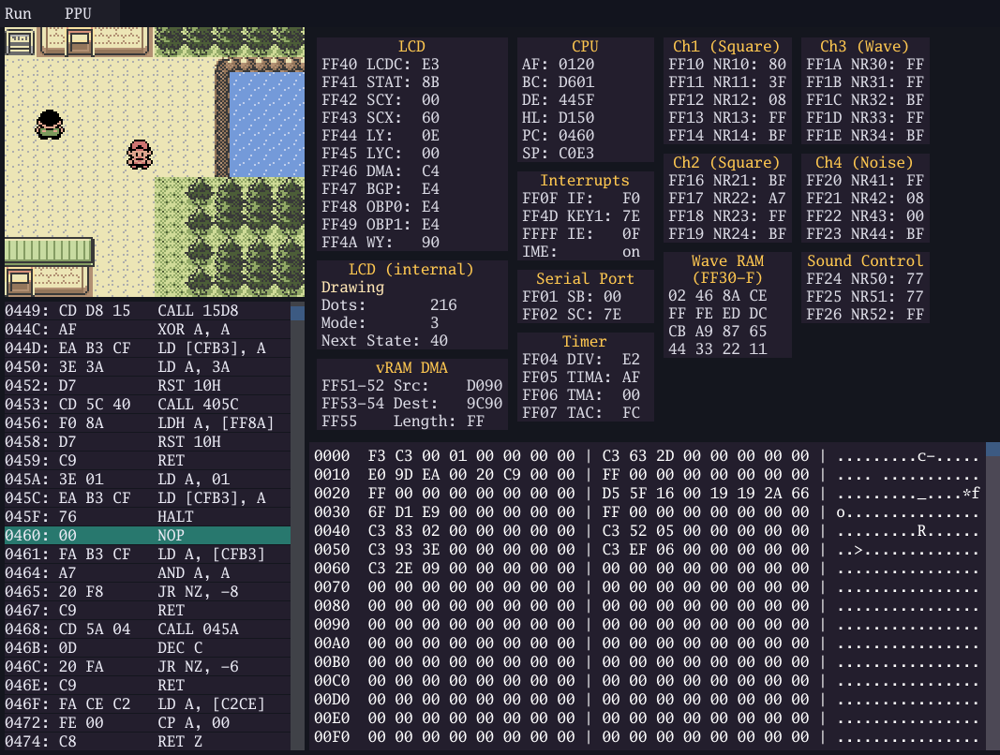

**Key Features:**
- **Disassembly View**: Real-time disassembly of the current instruction with breakpoint support
- **Memory Viewer**: Inspect memory contents at any address
- **Registers Viewer**: Monitor CPU and I/O registers
- **Step Controls**: Step through code execution with `F3` (Step), `F8` (Next), `F9` (Continue), `F10` (Next VBlank)
- **PPU Viewer**: Visualize Sprites/Background tiles and data

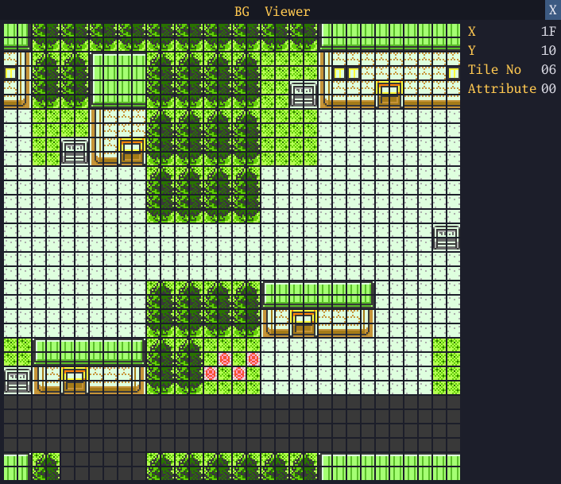

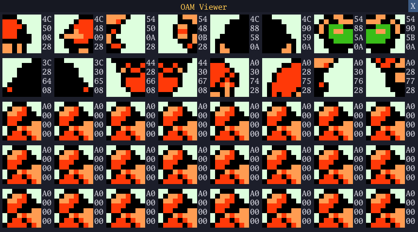

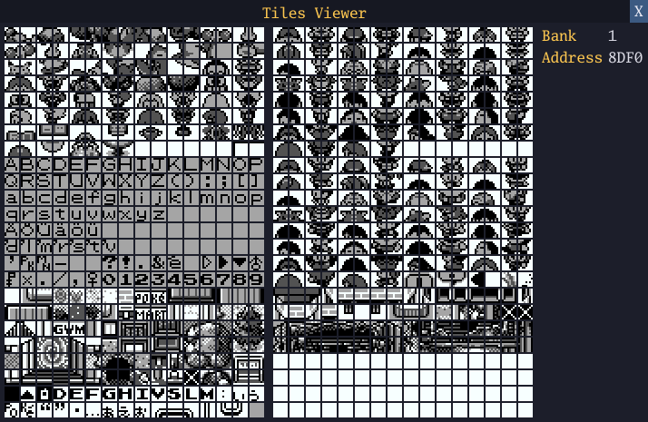

## Project Structure

```
.
├── boot/             # Boot ROMs
├── gameboy/          # Main emulator code (CPU, PPU, APU, memory)
├── ui/               # Ebiten-based GUI and input handling
│   ├── debugger/     # Integrated debugger components
│   └── theme/        # Graphic related code (theme, palettes, shaders)
├── util/             # Some simple util functions
├── main.go           # Entry point
└── README.md         # This file

```

## Getting Started

### Prerequisites

- **Go 1.24+** (see `go.mod` for version)

### Running

From the root directory:

```sh
go run .
```

- On launch, you will be prompted to select a Game Boy ROM file (`.gb` or `.gbc`).
- Controls:
  - **D-Pad**: Arrow keys
  - **A**: S
  - **B**: A
  - **Start**: X
  - **Select**: Z
  - **Ctrl+L**: Load a new game
  - **1-4**: Toggle audio channels
- By pressing `Space` the game will speed up at 2x
- The debugger can be launched from the emulator (press `Esc`)

## Resources

- [Pandocs](https://gbdev.io/pandocs/OAM.html)
- [Gameboy Development Wiki](https://gbdev.gg8.se/wiki/articles/Main_Page) ([sound hardware](https://gbdev.gg8.se/wiki/articles/Gameboy_sound_hardware))
- [Data Crystal](https://datacrystal.tcrf.net/wiki/Data_Crystal) (MBC testing)
- [Opcode table](https://gbdev.io/gb-opcodes/optables/) and [opcode reference](https://rgbds.gbdev.io/docs/v0.9.2/gbz80.7)
- [GBops](https://izik1.github.io/gbops/) (opcode timing)
- [Blargg](https://github.com/retrio/gb-test-roms), [Gekkio](https://github.com/Gekkio/mooneye-test-suite), [DMG acid](https://github.com/mattcurrie/dmg-acid2), [MBC3 RTC test](https://github.com/aaaaaa123456789/rtc3test) (test ROMs)
- [This reddit post](https://www.reddit.com/r/EmuDev/comments/59pawp/gb_mode3_sprite_timing/) for fixing PPU timing with sprites
- [AntonioND's Cycle-Accurate Gameboy Docs](https://github.com/AntonioND/giibiiadvance/blob/master/docs/TCAGBD.pdf) (very useful for some PPU timing issues)
- [Pokefan531 shader](https://pokefan531.tumblr.com/post/766008194709454848/handheld-lcd-shader-projects) for GBC color correction
- Multiple emulators were of inspiration, particularly [SameBoy](https://github.com/LIJI32/SameBoy) and [binjgb](https://github.com/binji/binjgb)

## TODO

- Add real-time save states, allowing users to save and load game state instantly during gameplay.
- Expand support for additional cartridge types and MBC variants.